# Web编程第二次项目报告

| 课程名称：Web编程 | 项目名称：数据展示网站 | 指导老师：王晔 |
| ----------------- | ---------------------- | -------------- |
| **姓名：郑佳辰**  | **学号：10182100359**  | **年级：2018** |

## 实验要求

基于第一个项目爬虫爬取的数据，完成数据展示网站。

基本要求：

1、用户可注册登录网站，非注册用户不可登录查看数据

2、用户注册、登录、查询等操作记入数据库中的日志

3、爬虫数据查询结果列表支持分页和排序

4、用Echarts或者D3实现3个以上的数据分析图表展示在网站中

5、实现一个管理端界面，可以查看（查看用户的操作记录）和管理（停用启用）注册用户。

扩展要求（非必须）：

1、实现对爬虫数据中文分词的查询

2、实现查询结果按照主题词打分的排序

3、用Elastic Search+Kibana展示爬虫的数据结果

## 网站整体介绍

### 数据库修改

本次的实验中展示的新闻数据来自上次爬虫实验中爬取的新闻页面，数据库与上次实验中采用的数据库相同，为MongoDB。为了实现要求中提到的各种功能，需要修改数据库添加新的文档集。实验参考了老师给出的示例代码。在本次实验中，需要在数据库中新建users和logs文档集，他们分别用来存储用户的基本信息和日志。

users文档集的字段包括ObjectId即_id，存储用户名的name，存储密码的passwd，标识账号是否可用的available，以及管理员专用的字段manage。其中name和passwd的数据类型为String类型，而available和manage字段的数据类型为整数，且取值为0或1。

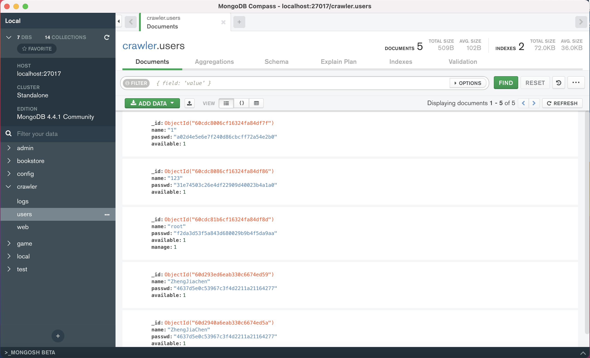

logs文档集的字段包括包括ObjectId即_id，存储用户名username，标识请求时间的request_time，标识请求方法的request_method，请求路径request_url等字段。它们的具体意义将在后面详细描述。

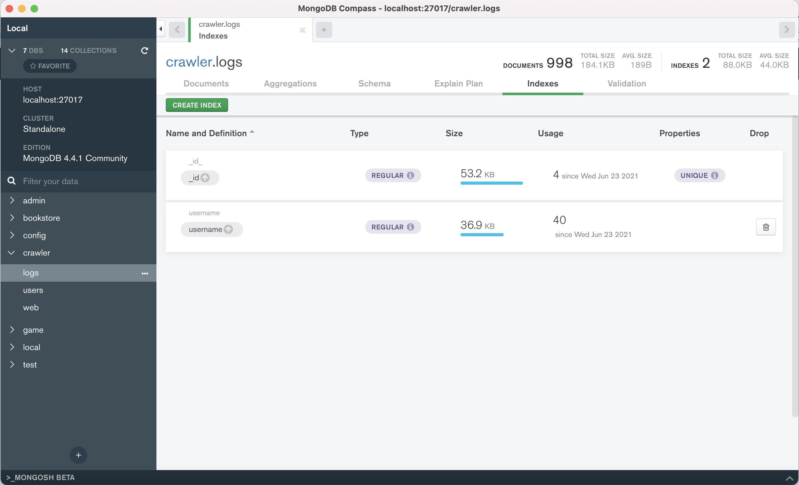

对于数据库的物理设计而言，在MongoDB中，除了_id字段上必然建立主索引之外，在其他字段上也可建立辅助索引。对于本次实验新建的users和logs文档集来说，他们都以用户名建立了索引，用于加速查询。在users文档集中是以name为关键字建立索引，而在logs文档集中是以username为关键字建立索引。

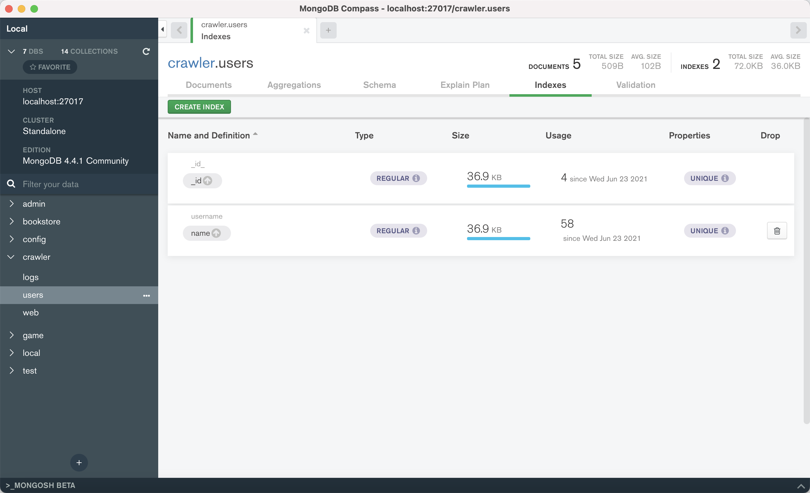

### 分层结构介绍

在宏观角度上，各功能的实现具有共性，即首先从前端接收用户输入的数据，然后传到后端进行处理，并对数据库进行访问。将数据库中返回的结果进行处理并传给前端，然后由前端渲染后显示给用户。这样就形成了一个简单的分层结构。

在软件体系架构设计中，分层式结构是最常见，也是最重要的一种结构。微软推荐的分层式结构一般分为三层，从下至上分别为：数据访问层、业务逻辑层（又或称为领域层）、表示层。区分层次的目的即为了“高内聚低耦合”的思想。第一层是数据访问层即Dao(Data Access Object)层，主要是对数据库的操作层。第二层是业务逻辑层(Service层)，主要是针对具体的问题的操作，也可以理解成对数据业务逻辑处理。第三是界面层，即controller层或action层，主要表示WEB方式。

在我的代码里，前端包括界面层，主要由`public/*.html`及`public/javaxcripts/*.js`组成，也包括public目录下的其他内容。用户输入的数据经html中调用的js代码向逻辑层发送。逻辑层属于后端的范围，包括`routes/*.js`中的node.js代码，这里主要是处理前端传输过来的数据，按照一定的业务逻辑访问数据库并返回结果。数据访问层的代码主要在`dao/*.js`中，用于访问数据库，其中的`mongodb.js`是之前已经编写好的对数据库的访问接口，方便直接调用。接下来将分功能介绍数据展示网站的各个功能实现。

## 基本要求实现

### 注册登录功能

在注册时，我们需要先从表单中接收数据，然后通过/users/register路径将数据传入后端，这里在前端对两次输入的密码进行比较，来确定用户两次输入的密码是否一致。同时，为了防止在日志中记录密码明文，或将密码明文直接显示到url里，这里采用了post的方法对数据进行传输，这样可以保护要传输的数据。如果注册成功，则使用跳转功能跳转到登录页面。

```javascript
//增加注册用户
$scope.doAdd = function () {
    // 检查用户注册时，输入的两次密码是否一致
    if($scope.add_password!==$scope.confirm_password){
        $scope.msg = '两次密码不一致！';
    }
    else {
        var data = JSON.stringify({
            username: $scope.add_username,
            password: $scope.add_password
        });
        $http.post("/users/register", data)
            .then(function (res) {
                if(res.data.msg=='成功注册！请登录') {
                    $scope.msg=res.data.msg;
                    $timeout(function () {
                        window.location.href='index.html';
                    },2000);

                } else {
                    $scope.msg = res.data.msg;
                }
            }, function (err) {
                $scope.msg = err.data;
            });
    }
};
```

在数据库中直接存储密码明文是非常不安全的，所以我使用了md5加密和简单的密码加盐技术存储密文。将明文转换为密文的过程在后端进行，在比较密码时直接比对密文即可。由于用户名是每个用户唯一的标识，所以需要先在后端检查用户是否存在，若不存在则可以添加用户，逻辑层代码如下所示。

```javascript
router.post('/register', function (req, res) {
  var add_user = req.body;
  add_user.password = md5("1999" + add_user.password + "1205");
  // 先检查用户是否存在
  userDAO.getByUsername(add_user.username, function (user) {
    if (user.length != 0) {
      res.json({msg: '用户已存在！'});
    }else {
      userDAO.add(add_user, function (success) {
        res.json({msg: '成功注册！请登录'});
      })
    }
  });

});
```

DAO层的代码如下所示。在本层尽量将每段代码分解成一次访问数据库的操作，在逻辑层再按照逻辑拼接成为一整个功能。这里可以看到查询用户主要靠用户名进行，将用户名建立一个索引可以加速这个查询过程。

```javascript
module.exports = {
    add: function (user, callback) {
        var ins = {"name":user.username, "passwd": user.password, "available": 1};
        mongo.insert_user(ins);
        callback(true);
    },
    getByUsername: function (username, callback) {
        var que = {"name": username};
        mongo.search_user(que, {}, {}, function(result){
            if (result.length == 0)
                callback(result);
            else callback(result[0]);
        });
    },
};
```

这里用到的访问数据库中user文档集的代码如下，与之前的版本大同小异。

```javascript
var insert_user = function(webjson) {
    MongoClient.connect(url, function(err, db) {
        if (err) throw err;
        var dbo = db.db("crawler");
        try{
            dbo.collection("users").insertOne(webjson, function(err, res) {
                if (err) console.log('注册时出错：' + err);
                console.log("注册成功");
                db.close();
            });
        } catch (e) { console.log('注册时出错：' + e) };
    });
};

var search_user = function(webjson, coljson, seqjson, callback) {
    MongoClient.connect(url, function(err, db) {
        if (err) console.log('查询/登陆出错：' + err);
        var dbo = db.db("crawler");
        dbo.collection("users").find(webjson).project(coljson).sort(seqjson).toArray(function(err, result) { 
            if (err) throw err;
            db.close();
            callback(result);
        });
    });
};
```

注册成功时的主页如下。

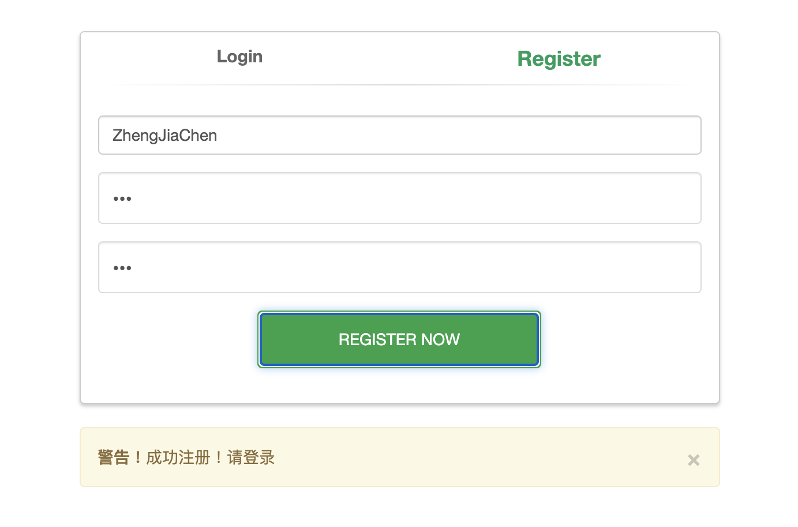

登录功能的设置与之相同，首先通过/users/login路径传输数据，然后从后端对比用户名和密码密文。在前端如果成功登录，则直接跳转到news所在路径。需要在此说明这种跳转方法只能跳转get方法可以显示的页面，如果是post方法对应的链接则不可跳转。

```javascript
$scope.check_pwd = function () {
    var data = JSON.stringify({
        username: $scope.username,
        password: $scope.password
    });
    $http.post("/users/login", data)
        .then(
        function (res) {
            if(res.data.msg=='ok') {
                window.location.href='/news.html';
            }else{
                $scope.msg=res.data.msg;
            }
        },
            function (err) {
            $scope.msg = err.data;
        });

};
```

登录时需要判断用户名是否存在，密码是否正确，也要判断该账号是否可用。如果在管理界面账户被停用，则无法登录。

```javascript
router.post('/login', function(req, res) {
  var username = req.body.username;
  var password = md5("1999" + req.body.password + "1205");

  userDAO.getByUsername(username, function (user) {
    console.log(user)
    if(user.length==0){
      res.json({msg:'用户不存在！请检查后输入'});
    }else {
      if(password===user["passwd"]){
        if(user["available"]===1){
          req.session['username'] = username;
          res.cookie('username', username);
          res.json({msg: 'ok'});
        } else {
          res.json({msg:'您的账号被禁用，请联系管理员！'});
        }
      }else{
        res.json({msg:'用户名或密码错误！请检查后输入'});
      }
    }
  });
});
```

这里以账号被禁用的情况为例展示账号被禁用情况下显示的内容，其他情况下同理。

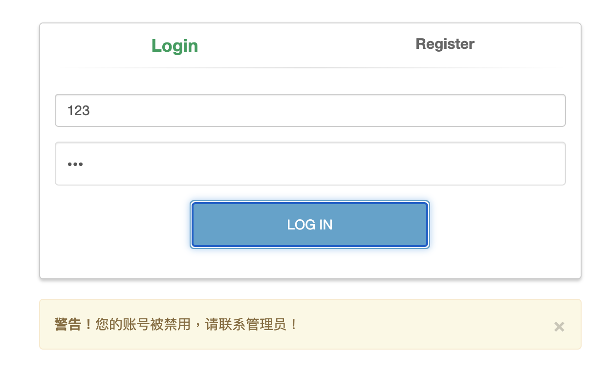

要实现未注册用户无法查看数据，有两种实现方式。一种是将html网页移出public文件夹，并将访问网页的所有路径除主页外全部设置为post方法。这样未登录的用户在访问页面时就会遇到错误。但是由于使用post方法访问网页时跳转比较困难，所以未采用这种方法。

另一种是将html文件保留在public文件夹中，但在访问数据时检查是否登录，如果有，则正常进行操作；如果没有，则强制跳转回登录页面。如下面的搜索功能的后端代码。如果session中没有username项，则直接跳转回主页。本项目中的登录检查以及权限检查大部分都采用这种方法。

```javascript
router.get('/search', function(request, response) {
    if (request.session['username']===undefined) {
        response.json({message:'url',result:'/index.html'});
    } else {
        var param = request.query;
        console.log(param);
        newsDAO.search(param, function (err, result, fields) {
            // console.log(result);
            response.json({message:'data',result:result});
        })
    }
});
```

### 记录日志

要完成记录日志的功能，有很多种放法可以做到，这取决于记录日志的粒度。如果需要每次访问就数据库都记录日志，或修改数据库时材记录日志，则可以在每次访问数据库的时候记录下对数据库的访问内容。如果对于用户每一次访问路径都需要记录日志，可以在用户每次访问相应路径时将用户的访问存储至数据库。这里选择的是后者，即在用户每次访问网站中的相应链接之时，将用户的访问信息用于生成session和日志，并且将日志存储至logs文档集中。

```javascript
let method = '';
app.use(logger(function (tokens, req, res) {
  console.log('打印的日志信息：');
  var request_time = new Date();
  var request_method = tokens.method(req, res);
  var request_url = tokens.url(req, res);
  var status = tokens.status(req, res);
  var remote_addr = tokens['remote-addr'](req, res);
  if(req.session){
    var username = req.session['username']||'notlogin';
  }else {
    var username = 'notlogin';
  }

  // 直接将用户操作记入mysql中
  if(username!='notlogin'){
    logDAO.userlog([username,request_time,request_method,request_url,status,remote_addr], function (success) {
      console.log('成功保存！');
    })
  }
```

向终端打印出的日志如下图所示，这里显示了tokens中的信息。

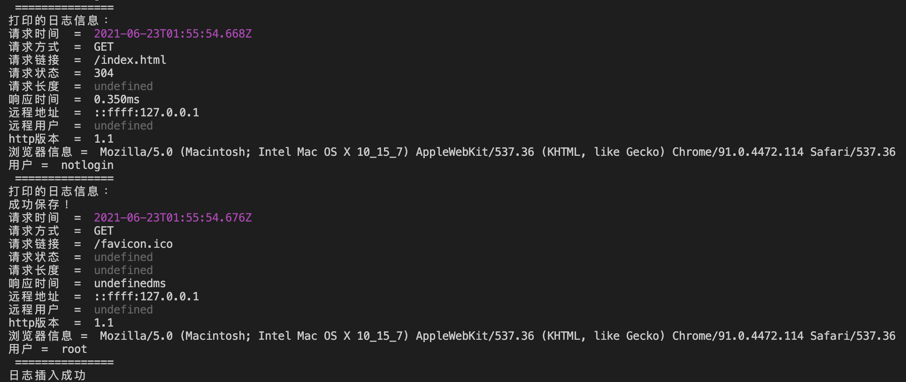

向logs文档集中存储日志信息的代码如下。这样就完成了一次日志的插入，可以在数据库中看到日志的具体格式。

```javascript
userlog :function (useraction, callback) {
        var ins = {"username":useraction[0],"request_time":useraction[1],"request_method":useraction[2],"request_url":useraction[3],"status":useraction[4],"remote_addr":useraction[5]};
        mongo.insert_logs(ins);
        callback(true);
    },

var insert_logs = function(webjson) {
    MongoClient.connect(url, function(err, db) {
        if (err) throw err;
        var dbo = db.db("crawler");
        try{
            dbo.collection("logs").insertOne(webjson, function(err, res) {
                if (err) console.log('插入日志时出错：' + err);
                console.log("日志插入成功");
                db.close();
            });
        } catch (e) { console.log('日志插入时出错：' + e) };
    });
};
```

日志中的username为用户的用户名，request_time记录了该操作的时间。request_method是请求的方法，一般有GET和POST两种。request_url是请求的路径，包含route路径下js中的路径和静态文件的路径。status是请求的状态，一般来说，200 OK和304 Not Modified都是成功访问的状态。remote_addr记录了这次访问的源ip地址，由于我一直是用自己的电脑进行访问的，所以该字段都是localhost。

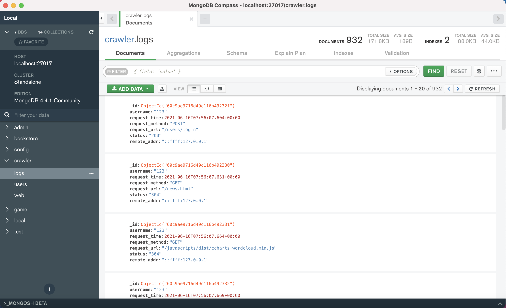

### 分页和排序

分页和排序的功能实现也有很多种方法，一种方法是将分页和排序放在访问数据库时。对于SQL数据库来说，在查询时使用limit和offset关键字取出特定的几条数据。对于我使用的MongoDB文档行数据库来说，也可以使用limit和skip关键字取出相应页码的记录。但这样的话，对于每一次翻页的行为，都需要访问一次数据库。这里的代码采用将分页和排序功能使用前端功能渲染做出。

在上一次的实验报告中已经展示过搜索功能的实现，这里不再重复进行展示。分页功能的实现主要在前端。在接收到后端返回的数据之后，前端会调用分页的函数用于进行分页。分页的具体原理就是在确定了总的页码数之后调用slice函数进行分页。

```javascript
// 查询数据
$scope.search = function () {
    var title = $scope.title;
    var keywords = $scope.keyword;
    var content = $scope.content;
    var allwords = $scope.allwords;
    var sorttime = $scope.sorttime;

    var myurl = `/news/search?t=${title}&k=${keywords}&c=${content}&a=${allwords}&stime=${sorttime}`;

    $http.get(myurl).then(
        function (res) {
            if(res.data.message=='data'){
                $scope.isisshowresult = true; //显示表格查询结果
                $scope.initPageSort(res.data.result)
            }else {
                window.location.href=res.data.result;
            }
        },function (err) {
            $scope.msg = err.data;
        });
};

// 分页
$scope.initPageSort=function(item){
    $scope.pageSize=5;　　//每页显示的数据量，可以随意更改
    $scope.selPage = 1;
    $scope.data = item;
    $scope.pages = Math.ceil($scope.data.length / $scope.pageSize); //分页数
    $scope.pageList = [];//最多显示5页，后面6页之后不会全部列出页码来
    $scope.index = 1;
    var len = $scope.pages> 5 ? 5:$scope.pages;
    $scope.pageList = Array.from({length: len}, (x,i) => i+1);

    //设置表格数据源(分页)
    $scope.items = $scope.data.slice(0, $scope.pageSize);
};
```

同时需要实现翻页的功能，翻页的方法是先通过函数获取当前页面，然后选取下一个要展示的页面，取出适当的条数并进行展示，具体代码如下。

```javascript
//打印当前选中页
$scope.selectPage = function (page) {
    //不能小于1大于最大（第一页不会有前一页，最后一页不会有后一页）
    if (page < 1 || page > $scope.pages) return;
    //最多显示分页数5，开始分页转换
    var pageList = [];
    if(page>2){
        for (var i = page-2; i <= $scope.pages && i < page+3; i++) {
            pageList.push(i);
        }
    }else {
        for (var i = page; i <= $scope.pages && i < page+5; i++) {
            pageList.push(i);
        }
    }

    $scope.index =(page-1)*$scope.pageSize+1;
    $scope.pageList = pageList;
    $scope.selPage = page;
    $scope.items = $scope.data.slice(($scope.pageSize * (page - 1)), (page * $scope.pageSize));//通过当前页数筛选出表格当前显示数据
    console.log("选择的页：" + page);
};

//设置当前选中页样式
$scope.isActivePage = function (page) {
    return $scope.selPage == page;
};
//上一页
$scope.Previous = function () {
    $scope.selectPage($scope.selPage - 1);
};
//下一页
$scope.Next = function () {
    $scope.selectPage($scope.selPage + 1);
};
```

以下是分页查询的显示结果，关键字为中国，两张图分别显示了第一页和第三页。

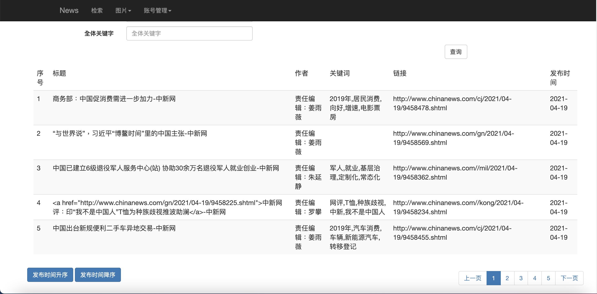

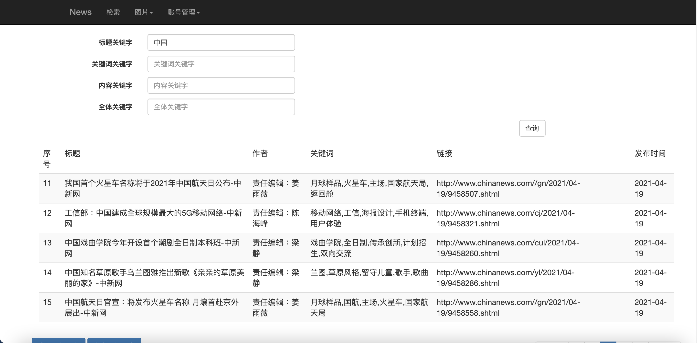

对于排序功能来说，使用数据库即后端进行实现是一种相对简单容易实现的方案，直接修改表示顺序的变量并重新执行一次查询即可。

```javascript
$scope.searchsortASC = function () {
    $scope.sorttime = '1';
    $scope.search();
};
$scope.searchsortDESC = function () {
    $scope.sorttime = '2';
    $scope.search();
};
```

同时在DAO层需要加入以下代码用于将查询结果排序。

```javascript
if(searchparam['stime']!="undefined"){
    if(searchparam['stime']=="1"){
        seq = {"publish_date": 1};
    }else {
        seq = {"publish_date": -1};
    }
}
```

以下是经过降序排序的查询结果（前面两张图均为升序排序），可以看到发布时间变为最晚的新闻。

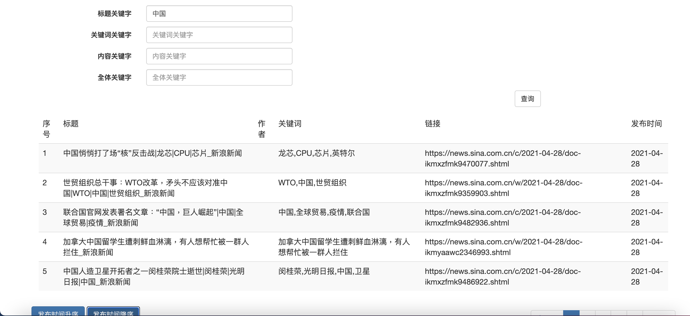

### 数据分析图表

```javascript
```

```javascript
```

```javascript
```

```javascript
```

```javascript
```

### 管理端界面

首先是管理端页面的跳转，在news页面中新加入向管理页面的跳转链接，并在js文件中编写对应的跳转函数。通过检查用户的权限确定起是否破能够进入管理页面，如果可以，则进行跳转，如果没有权限，则会弹出下图中的对话框。

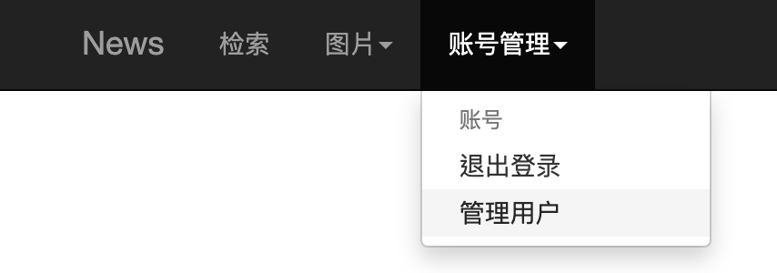

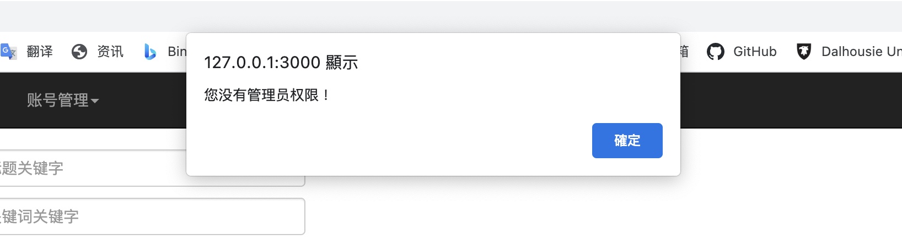

```javascript
$scope.manage = function () {
    $http.get("/users/manage").then(
        function (res) {
            if(res.data.msg != undefined){
                alert(res.data.msg);
            }else{
                window.location.href=res.data.result;
            }
        },function (err) {
            $scope.msg = err.data;
        }
    );
};
```

在进入逻辑层之后，系统会判断该用户是否有manage字段且该字段是否为1，如果数据库中的该用户没有该字段，则不可访问管理用户的页面。

```javascript
router.get("/manage", function(req, res, next){
  var usr = req.session["username"];
  if (usr===undefined) {
    response.json({message:'url',result:'/index.html'});
  } else {
    userDAO.getByUsername(usr, function (user) {
      if(user.length != 0 && user["manage"] == 1){
        res.json({result:'/manage.html'});
      } else {
        res.json({result:'/index.html',msg:'您没有管理员权限！'});
        return;
      }
    });
  }
});
```

进入管理页面之后，可以查询数据库中的日志，也可以启用或停用用户。最上面栏中单击管理可以展示下方的文本框，单击返回可以返回News页面。下图展示的是查询用户的日志出现的结果。

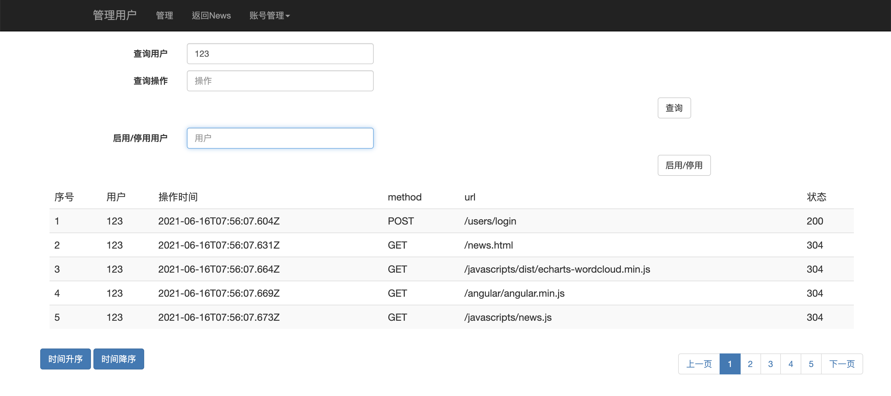

要查询用户之前的操作，需要用到数据库中记录的用户的操作日志，在这里设置的查询方式有两种，一种是查询用户名，另一个是根据链接查询用户的操作。两种查询方式取交集。在点击查询按钮时调用该页面上的search函数。

```html
<form class="form-horizontal" role="form">
    <div class="row" style="margin-bottom: 10px;">
        <label class="col-lg-2 control-label">查询用户</label>
        <div class="col-lg-3">
            <input type="text" class="form-control" placeholder="用户" ng-model="$parent.user">
        </div>
    </div>

    <div class="row" style="margin-bottom: 10px;">
        <label class="col-lg-2 control-label">查询操作</label>
        <div class="col-lg-3">
            <input type="text" class="form-control" placeholder="操作" ng-model="$parent.oper">
        </div>
    </div>

    <div class="form-group">
        <div class="col-md-offset-9">
            <button type="submit" class="btn btn-default" ng-click="search()">查询</button>
        </div>
    </div>

</form>
```

该函数会将链接和所需的参数构造好，然后发送给后端。对于后端返回的数据，采用和查询新闻相同的方法显示。

```javascript
// 查询数据
$scope.search = function () {
    var user = $scope.user;
    var oper = $scope.oper;
    var sorttime = $scope.sorttime;
    var myurl = `/manage/search?u=${user}&o=${oper}&stime=${sorttime}`;

    $http.get(myurl).then(
        function (res) {
            if(res.data.message=='data'){
                $scope.isisshowresult = true; //显示表格查询结果
                $scope.initPageSort(res.data.result)
            }else {
                window.location.href=res.data.result;
            }
        },function (err) {
            $scope.msg = err.data;
        });
};
```

在后端，首先需要判断用户信息，以确定其是管理员，然后从日志中查找需要的信息。如果没有权限，则返回主页的链接。

```javascript
router.get('/search', function(request, response) {
    console.log(request.session['username']);
    //sql字符串和参数
    if (request.session['username']===undefined) {
        // response.redirect('/index.html')
        response.json({message:'url',result:'/index.html'});
    } else {
        userDAO.getByUsername(request.session['username'], function (user) {
            if(user["manage"] === 1){
                var param = request.query;
                console.log(param);
                logDAO.search(param, function (err, result, fields) {
                    response.json({message:'data',result:result});
                });
            } else {
                response.json({message:'url',result:'/index.html'});
            }
        });
    }
});
```

在DAO层，网站会将管理员的请求转化成MongoDB的相应格式，然后进行查询。这里的两个文本框中输入的内容采取交集的形式查询，查询完成后将所得结果返回上层。可以看到在查询日志时，username采用的是严格匹配，而操作url只匹配路径的一部分即可。基于此在设计索引时，将username作为一个关键字建立索引，而对于操作的url不建立索引，因为正则表达式的匹配无法使用索引加速查询。

```javascript
search :function(searchparam, callback){
    var user = searchparam["u"];
    var oper = searchparam["o"];
    var and_array = [];

    if(user!="undefined")
        and_array.push({"username":user});
    if(oper!="undefined")
        and_array.push({"request_url":{"$regex":oper}});
    var que = {"$and":and_array};
    var col = {"_id":0, "remote_addr":0};
    var seq = {};
    if(searchparam['stime']!="undefined"){
        if(searchparam['stime']=="1"){
            seq = {"request_time": 1};
        }else {
            seq = {"request_time": -1};
        }
    }
    
    mongo.search_logs(que, col, seq, function(result){
        callback(null, result, null); //事件驱动回调
    });
}
```

下面是查找日志的mongodb接口。

```javascript
var search_logs = function(webjson, coljson, seqjson, callback) {
    MongoClient.connect(url, function(err, db) {
        if (err) console.log('查询日志出错：' + err);
        var dbo = db.db("crawler");
        dbo.collection("logs").find(webjson).project(coljson).sort(seqjson).toArray(function(err, result) { // 返回集合中所有数据
            if (err) throw err;
            db.close();
            callback(result);
        });
    });
};
```

对于启用和禁用功能来说，需要管理员输入被启用或者禁用的用户的用户名。考虑到用户的状态只有可用和不可用两种，所以将启用和禁用的按钮设置为同一个。

```html
<form class="form-horizontal" role="form">
    <div class="row" style="margin-bottom: 10px;">
        <label class="col-lg-2 control-label">启用/停用用户</label>
        <div class="col-lg-3">
            <input type="text" class="form-control" placeholder="用户" ng-model="$parent.forbiduser">
        </div>
    </div>

    <div class="form-group">
        <div class="col-md-offset-9">
            <input type="reset" class="btn btn-default" ng-click="stopit()" value="启用/停用"></input>
        </div>
    </div>
</form>
```

在启用和禁用按钮设置为同一个后会产生误解，所以需要对管理员进行提示，用以告诉管理员该用户究竟是已禁用还是启用。这里使用alert函数来实现这一功能，该函数可以直接弹出对话框，相对来说比较方便。网页中前端调用的javascript代码如下。

```javascript
$scope.stopit = function () {
    var fuser = $scope.forbiduser;
    var myurl = `/manage/forbid?username=${fuser}`;

    $http.get(myurl).then(
        function (res){
            alert(res.data.result);
        }
    );
};
```

进入后端之后，首先系统需要判断进行次操作的是不是管理员。然后再查找需要被启用或禁用的用户存在不存在，然后根据其信息确定该启用该用户还是禁用该用户，最后修改文档集中该用户对应的文档的值。经过多次判断，该语句才可以执行。

```javascript
router.get('/forbid', function(request, response){
    console.log(request.session['username']);
    //sql字符串和参数
    if (request.session['username']===undefined) {
        // response.redirect('/index.html')
        response.json({message:'url',result:'/index.html'});
    } else {
        userDAO.getByUsername(request.session['username'], function (user) {
            if(user["manage"] === 1){
                var usr = request.query.username;
                userDAO.getByUsername(usr, function(user){
                    if(user.length == 0)
                        response.json({message:'data',result:"该用户不存在！"})
                    else{
                        var nsta = 1 - user["available"];
                        userDAO.forbid(usr, nsta, function(stat){
                            if(nsta) response.json({message:'data',result:"启用用户成功！"});
                            else response.json({message:'data',result:"禁用用户成功！"});
                        });
                    }
                });
            } else {
                response.json({message:'url',result:'/index.html'});
            }
        });
    }
});
```

DAO层中的更新操作如下，需要注意的是，DAO层中的操作最好可以被封装为单次访问数据库的操作，所以这里的forbid操作只访问一次数据库，判断部分留给其他的操作执行。

```javascript
forbid: function(username, setavai, callback){
    var whe = {"name": username};
    var upd = {$set: {"available": setavai}};
    mongo.update_user(whe, upd, function(result){
        console.log(result);
        callback(true);
    });
}
```

修改users文档集中文档的代码如下。将数据库中available字段修改掉，在登录时就不会允许其登录。

```javascript
var update_user = function(wherejson, updatejson, callback) {
    MongoClient.connect(url, function(err, db) {
        if (err) console.log('查询/登陆出错：' + err);
        var dbo = db.db("crawler");
        dbo.collection("users").updateOne(wherejson, updatejson, function(err, result) { // 返回集合中所有数据
            if (err) throw err;
            console.log("文档更新成功")
            console.log(result)
            db.close();
            callback(result);
        });
    });
};
```

启用/禁用操作成功后弹出的对话框如图所示。

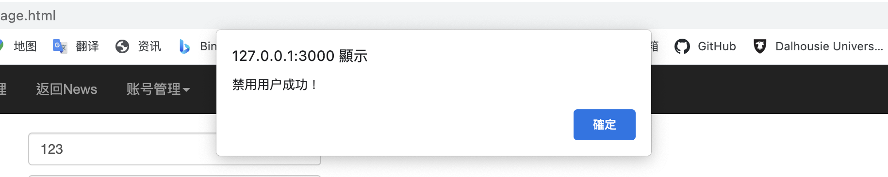

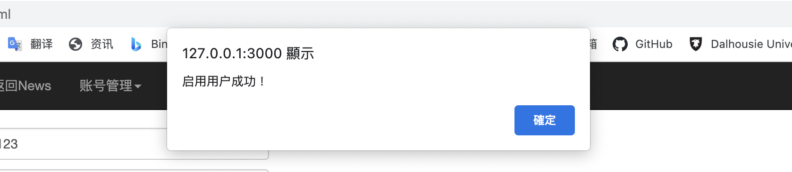

## 扩展要求实现

### 中文分词查询

对于中文分词的查询我选择放在上次实验中content的搜索框中，这样当用户想要查找新闻主体中的内容时，不直接严格匹配而是先进行分词之后再匹配。这样可以是收缩结果更加丰富，容错性更高。分词工具采用nodejieba库，核心代码如下。

当用户决定搜索内容时，默认其可能会输入一句话。然后对这句话进行分词，由于之后还需实现根据查询结果打分的功能，所以这里直接采用extract方法提取出关键词。如果需要实现严格的分词，需要使用`nodejieba.cut()`函数。在获取到要搜索的词之后，将其作为一个并集写入查询语句，即可完成中文分词的查询。

由于中文分词查询配合了下面的查询结果打分一同展示，所以效果的展示在下一节中呈现。

```javascript
if(content!="undefined"){
    words = nodejieba.extract(content, key_n);
    for (var i=0; i<words.length; i++){
        wd = words[i];
        words_array.push({"content":{"$regex":wd["word"]}})
    }
    or_array.push({"$or":words_array})
}
```


### 查询结果打分

查询结果打分可以配合之前的中文分词的查询一起使用，在进行过中文分词之后，取出的文档的顺序可能是没有规律的，此时就需要对搜索结果进行排序，这样才能给用户它们最想要查询到的结果。

在搜索到相应内容之后，如果没有设定顺序且内容项不为空，就开始对结果进行打分。打分的标准基于tfidf，具体方法如下：对于要搜索的词，之前以处理出tf-idf的值。将content中的内容提取关键词，如果关键词中有和要搜索的词重合的词，就加上搜索的词的tfidf值作为权重。这种打分方式既能很好的利用用于新闻中的信息，又能够体现一句话中不同词不同的重要程度。在得到打分之后再对搜索结果进行排序即可。

```javascript
mongo.search_web(que, col, seq, function(result){
    if(searchparam['stime']=="undefined"){
        if(content!="undefined" && words!=undefined){
            var m = new Map();
            for(var i = 0; i < words.length; i++){
                var t = words[i];
                m.set(t["word"], t["weight"]);
            }
            for(var i=0;i<result.length;i++){
                var ele = result[i];
                var temp_content = ele["content"];
                var contentkeywds = nodejieba.extract(temp_content, key_n);
                var s = 0;
                for (var j=0; j<contentkeywds.length; j++){
                    var wwd = contentkeywds[j];
                    if(m.has(wwd["word"])){
                        s += m.get(wwd["word"]);
                    }                    
                }
                (result[i])["weight"] = s;
            }
        }
    }
    result.sort(function(a,b){
        return b["weight"] - a["weight"];
    })
    callback(null, result, null); //事件驱动回调
});
```

```javascript
```

```javascript
```

```javascript
```

## 代码链接

目前我本次实验的代码已上传至Github，链接为：https://github.com/ChiachenCheng/NewsShow

上一次实验的代码已于上次DDL之前上传至Github，链接为：https://github.com/ChiachenCheng/NewsCrawler